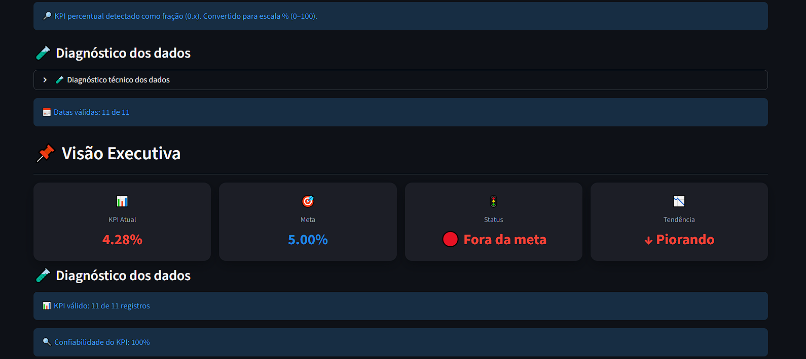
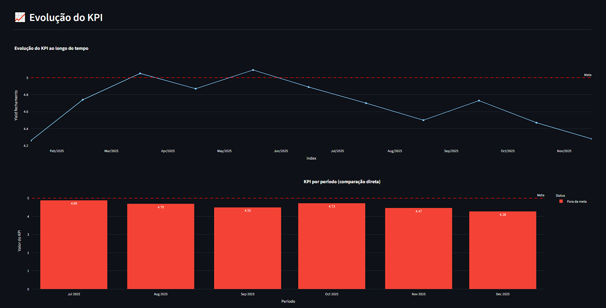
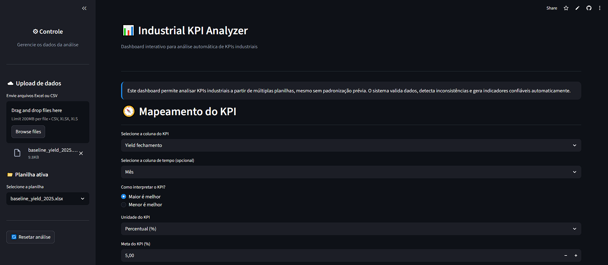
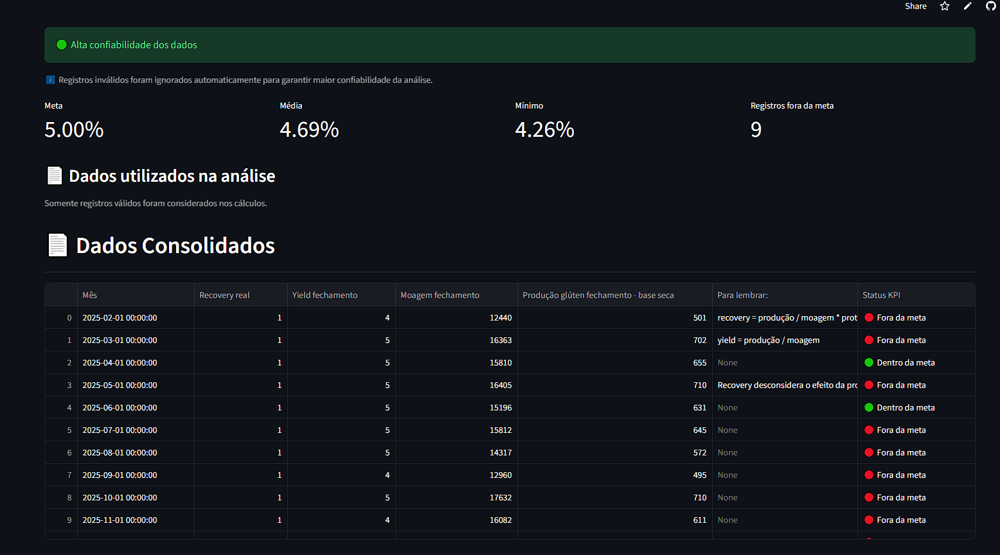

# Industrial KPI Analyzer  
Dashboard para Análise Automática de KPIs Industriais

### 🧪 Diagnóstico dos Dados

### 🔹 Visão Executiva

### 🔹 Evolução do KPI ao longo do tempo

## 📊 Visão Geral do Dashboard

### 🔹 Dados Consolidados

Aplicação em Streamlit para análise automática de KPIs industriais a partir de arquivos Excel ou CSV.

## O que o sistema faz

- Aceita múltiplos arquivos (.xls, .xlsx, .csv)
- Trata dados não padronizados
- Valida confiabilidade das informações
- Gera KPIs e tendências automaticamente

## Como usar

1. Envie uma planilha
2. Selecione o KPI
3. Defina a meta
4. Analise os indicadores e gráficos

## Observações

- Registros inválidos são ignorados automaticamente para reduzir risco de erro
- O sistema indica a confiabilidade dos dados analisados, apoiando decisões mais seguras

